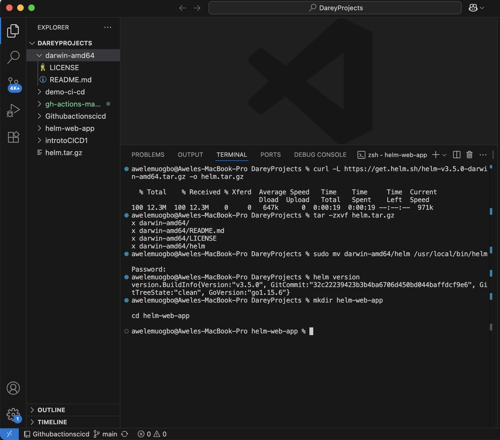
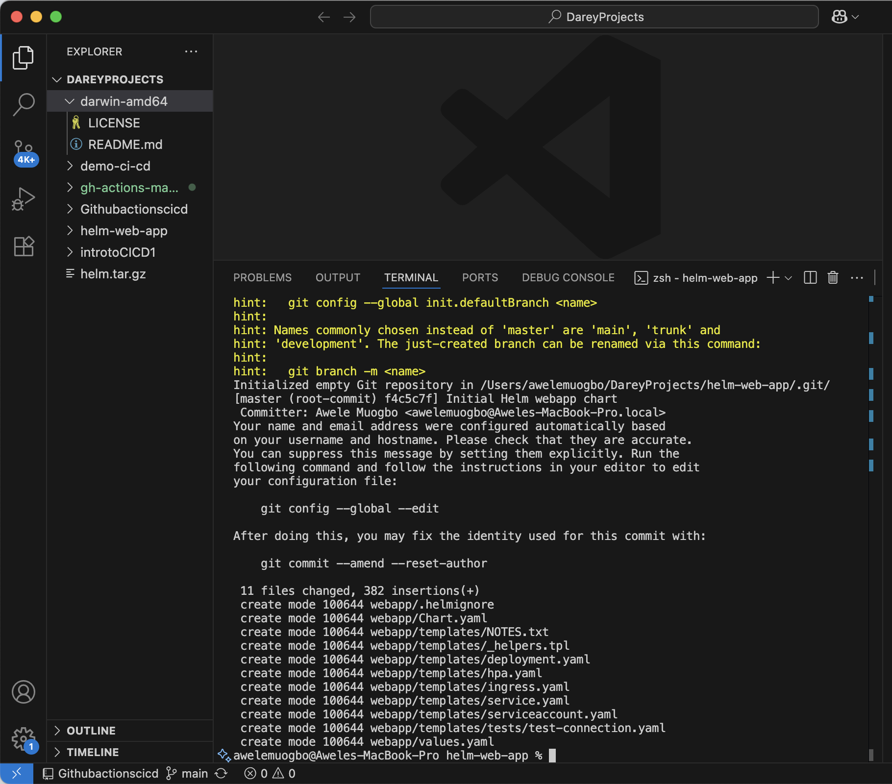

# Introductiontohelmchart

TITLE: Introduction to Herm Chart

## EXECUTIVE SUMMARY
I prepared Helm on my workstation, generated a fresh Helm chart for a basic containerized web service, tailored the chart via templates and values, validated the rendered manifests locally, and rolled out the release to a Kubernetes cluster. I also described how I wired the workflow into a straightforward Jenkins pipeline so future edits to either the image or the chart move through environments in a repeatable way. The only practical hiccup I ran into was trying to execute an Intel/AMD Helm binary on an Apple Silicon MacBook; enabling Rosetta 2 solved it instantly and let me continue the lab without retooling. Throughout, I documented the rationale behind each action, what to check for success, what can break, and how I would troubleshoot it. I’m thankful to Darey.io—the lab nudged me to go deeper than the basics and tie the entire Helm lifecycle together.

## OBJECTIVES

1. Get Helm running locally and confirm it can communicate with my Kubernetes cluster.
2. Scaffold a brand-new Helm chart for the app.
3. Adjust metadata, defaults, and templates to fit the application.
4. Use local linting and template rendering to catch issues ahead of deployment.
5. Install, upgrade, examine, and remove a Helm release in the cluster.
6. Outline and verify a lean CI/CD approach so deployments are consistent and reproducible.

## SCOPE, BOUNDARIES, AND ASSUMPTIONS
This iteration targets a single namespace and a stateless web service with no external database. kubectl access is assumed via my local kubeconfig. Docker is available for building/pushing images. I keep exposure simple (ClusterIP or NodePort for local, with a note on LoadBalancer in cloud). Production concerns like TLS, secret management, and deep observability are acknowledged but not fully implemented here.

## ENVIRONMENT AND PREREQUISITES I CONFIRMED
– macOS on Apple Silicon (ARM64).
– VS Code integrated terminal for shell access.
– Docker installed and running.
– A working Kubernetes cluster; local testing used a single-node setup with a Docker driver.
– Git set up for version control and later Jenkins integration.
– A reachable Jenkins server for pipeline tests.
– Baseline Kubernetes literacy: Pods, Deployments, Services, and context switching.

## WHY HELM MADE SENSE FOR THIS WORK
Helm packages Kubernetes resources as versioned charts and adds a values-driven templating system. That yields consistent installs/upgrades/rollbacks, environment-specific overrides, and a clean seam for CI/CD. In short, it’s a natural fit for promoting the same app through multiple stages with minimal drift.

## STEP 1: INSTALLING HELM AND PROVING CONNECTIVITY

1. Why I followed the direct binary path first
   The lab flow emphasized downloading the binary tarball, extracting it, placing it on PATH, and verifying. Doing it this way makes where the tool lives and how it’s invoked explicit—useful when reproducing inside CI images or debugging path issues later.

2. What happened on Apple Silicon
   I fetched the binary, extracted it, and attempted to run it. The artifact I initially grabbed was for x86\_64 (Intel/AMD). On ARM64 Macs, that doesn’t run natively.

3. The precise symptom and my workaround
   Symptom: the Helm executable wouldn’t launch because it targeted the wrong CPU architecture.
   Fix: I enabled Rosetta 2 on my Apple Silicon Mac, allowing execution of x86\_64 programs. Immediately after enabling Rosetta 2, Helm ran and returned its version. This kept me aligned with the lab’s install flow while unblocking progress.
   Note to future me: a native ARM64 Helm (or a package manager that auto-selects the right build) is cleaner long-term, but Rosetta 2 was the fastest route for this lab.

4. How I validated the setup
   I requested the Helm client version to confirm the binary worked. Then I checked my active kubeconfig context and verified that kubectl could reach the cluster by listing nodes and namespaces. If kubectl can talk to the API server, Helm can too.

5. Likely pitfalls here and my remedies
   – Wrong-arch binary (my real issue): enable Rosetta 2 or pull the ARM64 build.
   – Permission errors when placing the binary: use administrative privileges or choose a user-writable directory already on PATH.
   – PATH not updated: ensure the destination directory is in PATH and open a fresh shell.
   – Cluster unreachable: fix kubeconfig and networking first; Helm relies on the same context.
   – Enterprise proxy or SSL interception: configure proxy env vars and trust stores appropriately.

## STEP 2: GENERATING A NEW HELM CHART

1. Why I began with the chart scaffold
   The scaffold gives a conventional layout—Chart.yaml, values.yaml, templates for Deployment and Service, helper templates, and NOTES—so I can focus on values and structure rather than crafting every YAML by hand.

2. Project folder and chart creation
   I created a clean working directory, moved into it, and generated a chart named “webapp.” That name flows into resource naming via helper templates, so picking something clear helps with consistency and discoverability. Keeping the folder tidy made the first commit straightforward.

3. What each generated file is for
   – Chart.yaml: metadata for the chart itself (name, description, version) and the app version. Bump the chart version for chart changes; appVersion reflects the app’s image or release.
   – values.yaml: default configuration used by templates—image repository/tag, pull policy, service type/ports, replica count, resource requests/limits, and any non-secret env vars.
   – templates/deployment.yaml: the Deployment spec using image values and labels.
   – templates/service.yaml: a Service that targets Pods via labels.
   – templates/\_helpers.tpl: shared snippets for names/labels to keep everything aligned.
   – templates/NOTES.txt: guidance printed after install on how to reach the app.
   – charts/ : placeholder for vendored subcharts.
   – .helmignore: files excluded from chart packages.

## STEP 3: TUNING THE CHART TO THE APP

1. Container image choices
   Inside values.yaml I set the repository and tag for my sample image. For local work I used an “IfNotPresent” pull policy to avoid wasteful pulls. In CI/CD I prefer tags tied to commit SHA or semver so I can reliably roll back.

2. Replicas and resource bounds
   For a local run I left replicaCount at 1, but I added requests/limits so scheduling stays predictable—even small clusters behave better when every Pod declares its footprint.

3. Service exposure decisions
   For local testing, NodePort is simple to reach from my machine. In cloud, a LoadBalancer is more natural and yields an external IP automatically. I verified that the service port in values.yaml lines up with the containerPort in the Deployment.

4. Config and environment variables
   I included a small env section to show how values flow into the container spec. Anything sensitive should come from a Secret and never live in values.yaml committed to Git.

5. Template consistency
   I confirmed labels and names all flow through the shared helpers. This prevents the classic mismatch where a Service selector fails to match Pod labels and therefore has zero endpoints.

## STEP 4: PRE-DEPLOYMENT VALIDATION

1. Running the linter
   Helm lint catches structural mistakes early—missing fields, YAML issues, or broken template references—so I can fix locally before the API server rejects anything.

2. Rendering templates locally
   I rendered manifests to plain YAML to see exactly what will be applied. I read through the Deployment, Service, and labels to verify selectors and values substituted as intended.

3. What might break here and my approach
   – YAML indentation errors: fix spacing; rerun lint and render.
   – Missing values: rendering shows placeholders or empty strings; add those to values.yaml or provide an overlay values file.
   – Incompatible apiVersions: adjust resource apiVersion to match the cluster’s supported levels.

## STEP 5: INSTALLING AND WORKING THE RELEASE LIFECYCLE

1. Initial install
   I installed the chart with a clear release name. Helm created the objects and printed helpful NOTES about accessing the service. I checked the namespace to see the resources appear.

2. What I checked afterward
   – Release shows as deployed in the release list.
   – Service description reveals the assigned NodePort or relevant details.
   – For quick tests, I used port-forwarding to the Service or Pod.
   – I tailed Pod logs to confirm the container started and served responses.

3. Proving upgrades
   I changed something small—such as replicaCount or a config flag—and issued an upgrade using the same release name. I watched the rollout to see a new ReplicaSet come up and traffic move over.

4. Packaging and uninstalling
   I created a chart package archive for storage or publication. I also uninstalled the release to ensure Helm cleaned up everything it owned. Listing releases afterward showed it marked as uninstalled, confirming a clean tear-down path.

5. Common runtime issues and my remedies
   – Image pull errors: wrong repo/tag, private registry without credentials, or architecture mismatch. I verify the image, configure imagePullSecrets if needed, and build multi-arch images when appropriate.
   – Service without endpoints: label/selector mismatch; compare Pod labels with the Service selector and fix templates or defaults.
   – CrashLoopBackOff: incorrect command, env, or port; read logs and events, correct values, and upgrade.
   – RBAC denials: if the chart introduces roles, align with least privilege and cluster policy.
   – NodePort conflicts: rely on auto-allocated ports or pick a valid, unused port.

## STEP 6: CI/CD WITH JENKINS—WHAT I SET UP AND WHY

1. Pipeline layout
   Stages included checkout, image build and tag, push to registry, chart lint and render, then a deploy that uses upgrade-install semantics. Registry and cluster credentials live in Jenkins credentials and are injected at runtime.

2. Ordering rationale
   – Build and push first so the chart points at a tag that exists.
   – Lint prior to deployment to catch template problems fast.
   – Upgrade-install keeps the job idempotent across runs.
   – Using commit SHAs for tags creates immutable versions and makes rollbacks easy.

3. Agent subtleties
   On Apple Silicon, any agent that runs Helm or Docker must either use native ARM builds or rely on Rosetta for x86\_64 tools. For containers, I prefer multi-platform images or ARM base images so Pods can schedule on ARM nodes if needed.

4. CI verification
   After deployment, the pipeline checked rollout status and printed Pod conditions. Failures raise a non-zero exit to stop the line. I archived the rendered manifests and packaged chart as build artifacts for traceability.

## THE ONE FAILURE I ACTUALLY HIT AND HOW I RESOLVED IT

Observed failure: attempting to run an x86\_64 Helm binary on an ARM64 Mac.
Cause: I initially downloaded an Intel/AMD build.
Effect: the binary wouldn’t execute natively.
Fix: enable Rosetta 2 on macOS; afterward the same binary ran normally.
Proof: version output succeeded; lint, render, install, list, and other Helm operations all worked.
Prevention going forward: prefer native ARM64 Helm or a manager that selects the right architecture automatically.

## OTHER PROBLEMS I ANTICIPATED (AND MY READY FIXES)

1. PATH and permissions
   If moving the binary fails with permission issues, place it in a user-owned directory on PATH or update PATH in the shell profile. Open a new terminal to pick up changes.

2. Wrong or stale Kubernetes context
   If Helm can’t reach the API server, check current contexts, switch intentionally, and verify with kubectl. Using a dedicated namespace per lab avoids collisions.

3. Immutable field changes on upgrade
   Switching a Service type, for instance, can be blocked. In that case, plan a delete-and-recreate for that resource or document a migration step in the release notes.

4. Image architecture mismatches
   If cluster nodes are amd64 but the image is arm64 (or vice versa), Pods will stay pending. Rebuild as multi-arch or match the node architecture.

5. Template key typos
   If a template references a non-existent value, rendering exposes it. Add the key to values.yaml or supply it through environment-specific values files.

## OBSERVABILITY AND OPERATIONAL CHECKS I RAN

– Read initial Pod logs to confirm the app responded to requests.
– Described the Service to ensure targetPort and containerPort aligned.
– Reviewed the Deployment’s ReplicaSets to confirm upgrades created a new revision.
– Checked namespace events for scheduling or pull errors.
– Verified uninstall fully removed release-owned objects.

## WHAT I EXPLORED BEYOND THE CORE LAB

– How helper templates enforce consistent labels and why that consistency matters for discovery.
– Chart version vs. application version, and how they evolve independently.
– Using additional values files to cleanly separate dev, staging, and production overrides.
– Practical Apple Silicon considerations when upstream artifacts default to x86\_64, and how Rosetta 2 can be a pragmatic bridge.
– Treating “helm upgrade —install” as a convergent deployment step in CI so re-runs are safe.

## TOWARD PRODUCTION: RISKS AND HOW I’D ADDRESS THEM

– Secrets: keep them in a dedicated secrets manager and surface them via Kubernetes Secrets or CSI; never commit sensitive values to values.yaml.
– RBAC: apply least-privilege roles and dedicated service accounts per release.
– Exposure: for internet traffic, use an Ingress controller with TLS instead of NodePort.
– Sizing: tune requests/limits based on real telemetry.
– Probes: add readiness/liveness checks so rollouts validate actual health.
– Rollbacks and provenance: store and sign chart packages; make rollback paths explicit.

## ACKNOWLEDGMENT
I’m sincerely thankful to Darey.io for this guided exercise. It helped me internalize Helm’s mental model and also face a realistic environment quirk—architecture differences on Apple Silicon. The clarity of the materials made it easy to go further: linting and rendering locally, validating rollouts, packaging the chart, practicing clean uninstalls, and sketching a CI/CD hand-off.

## CONCLUSION
The project met its goals: I used Helm to package, configure, and deploy a simple web app to Kubernetes and connected the process to a lean CI/CD workflow. I installed Helm and confirmed connectivity, scaffolded a chart, tailored templates and defaults, validated locally, then worked through the full release lifecycle on the cluster. The sole real-world snag—an x86\_64 Helm on ARM64 hardware—was quickly solved by enabling Rosetta 2, showing that the development setup can flex without derailing momentum. More importantly, I now have a repeatable approach: lint, render, package, version, and promote charts; build images with immutable tags; deploy idempotently; observe rollouts; and roll back when needed. The same pattern scales to more complex services because it rests on clear configuration, careful templating, early validation, and explicit health checks.
Next on my roadmap: create per-environment values files, introduce an Ingress with TLS, feed secrets from a manager, and enhance CI/CD with automated rollback on unhealthy deployments. As it stands, the lab outcome is complete, repeatable, and a strong template for future Kubernetes workloads in my portfolio.

the images below depicts these. 

